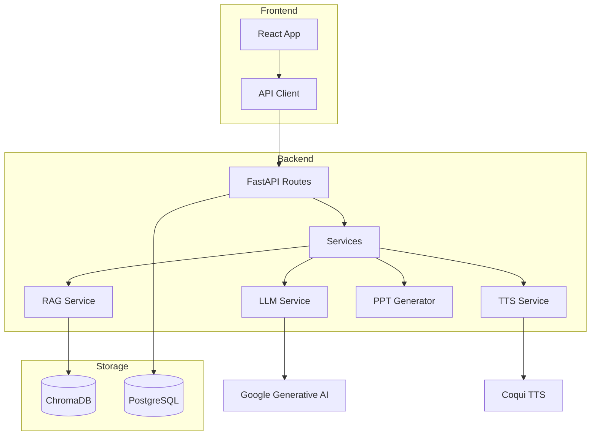

# Study Assistant – Project Structure

A full-stack **Study Assistant** application for learning with AI-powered content generation, including slides, podcasts, flashcards, quizzes, explainer videos, and RAG-based chat.

---

## Technology Stack

| Layer         | Technology                                                           |
| ------------- | -------------------------------------------------------------------- |
| **Frontend**  | React 19 + Vite + TailwindCSS 3                                      |
| **Backend**   | FastAPI + Uvicorn + Pydantic                                         |
| **AI/LLM**    | LangChain + Google Generative AI + HuggingFace Sentence Transformers |
| **Vector DB** | ChromaDB                                                             |
| **Database**  | PostgreSQL (SQLAlchemy + asyncpg)                                    |
| **TTS**       | Coqui TTS                                                            |
| **Video**     | MoviePy + Playwright (slide capture)                                 |
| **Auth**      | JWT (python-jose) + Passlib/Bcrypt                                   |

---

## Directory Structure

```
Builder/
├── backend/                   # FastAPI Backend
│   ├── app/
│   │   ├── main.py            # App entrypoint, router registration
│   │   ├── db/
│   │   │   ├── chroma.py      # ChromaDB vector store connection
│   │   │   └── postgres.py    # PostgreSQL connection
│   │   ├── models/            # SQLAlchemy ORM models
│   │   │   ├── user.py
│   │   │   ├── notebook.py
│   │   │   ├── material.py
│   │   │   ├── chat_history.py
│   │   │   ├── generated_content.py
│   │   │   └── schemas.py
│   │   ├── prompts/           # LLM prompt templates
│   │   │   ├── __init__.py    # Prompt loaders
│   │   │   ├── slide_generation_prompt.txt
│   │   │   ├── podcast_prompt.txt
│   │   │   ├── explainer_prompt.txt
│   │   │   ├── flashcard_prompt.txt
│   │   │   ├── quiz_prompt.txt
│   │   │   └── chat_prompt.txt
│   │   ├── routes/            # API endpoints
│   │   │   ├── auth.py        # /auth (login, signup, logout)
│   │   │   ├── notebook.py    # /notebook CRUD
│   │   │   ├── upload.py      # /upload (material upload)
│   │   │   ├── slide.py       # /slide (PPT generation)
│   │   │   ├── podcast_router.py  # /podcast (audio generation)
│   │   │   ├── explainer.py   # /explainer (video generation)
│   │   │   ├── flashcard.py   # /flashcard
│   │   │   ├── quiz.py        # /quiz
│   │   │   └── chat.py        # /chat (RAG conversation)
│   │   └── services/          # Business logic
│   │       ├── auth/          # Authentication services
│   │       ├── chat/          # Chat service
│   │       ├── explainer/     # Video explainer pipeline
│   │       ├── flashcard/     # Flashcard generator
│   │       ├── llm_service/   # LLM wrapper
│   │       ├── podcast/       # Podcast generator
│   │       ├── ppt_generator/ # PowerPoint builder
│   │       ├── quiz/          # Quiz generator
│   │       ├── rag/           # Retrieval-Augmented Generation
│   │       ├── slide_generation/ # Slide content generation
│   │       ├── text_processing/  # Chunker + extractors
│   │       ├── text_to_speech/   # TTS service
│   │       ├── logger.py
│   │       ├── material_service.py
│   │       ├── notebook_name_generator.py
│   │       └── notebook_service.py
│   ├── data/                  # ChromaDB storage
│   ├── output/                # Generated files output
│   ├── tests/                 # Test files
│   ├── requirements.txt       # Python dependencies
│   └── .env                   # Environment variables
│
└── frontend/                  # React Frontend
    ├── src/
    │   ├── main.jsx           # React entrypoint
    │   ├── App.jsx            # Root component with auth routing
    │   ├── index.css          # Global styles + Tailwind
    │   ├── api/               # API client modules
    │   │   ├── config.js      # API base URL & axios setup
    │   │   ├── auth.js        # Auth API calls
    │   │   ├── notebooks.js   # Notebook API calls
    │   │   ├── materials.js   # Material upload/fetch
    │   │   ├── generation.js  # Content generation (slides, podcast, etc.)
    │   │   └── chat.js        # Chat API calls
    │   ├── components/        # UI Components
    │   │   ├── AuthPage.jsx   # Auth wrapper
    │   │   ├── Login.jsx      # Login form
    │   │   ├── Signup.jsx     # Signup form
    │   │   ├── Header.jsx     # Top navigation
    │   │   ├── Sidebar.jsx    # Source management sidebar
    │   │   ├── ChatPanel.jsx  # RAG chat interface
    │   │   ├── StudioPanel.jsx # Content generation studio
    │   │   ├── HomePage.jsx   # Notebook selection dashboard
    │   │   ├── NotebookSelector.jsx
    │   │   ├── NoteItem.jsx
    │   │   ├── SourceItem.jsx
    │   │   ├── ChatMessage.jsx
    │   │   └── FeatureCard.jsx
    │   ├── context/           # React Context providers
    │   │   ├── AppContext.jsx # App state (notebook, materials, etc.)
    │   │   └── AuthContext.jsx # Auth state (user, tokens)
    │   └── hooks/             # Custom React hooks
    ├── public/
    ├── package.json
    ├── tailwind.config.js
    └── vite.config.js
```

---

## Data Flow



---

## API Endpoints Summary

| Tag       | Endpoint             | Description                   |
| --------- | -------------------- | ----------------------------- |
| auth      | `POST /auth/*`       | Login, signup, logout, me     |
| notebooks | `GET/POST /notebook` | Notebook CRUD                 |
| upload    | `POST /upload`       | Upload PDF/PPTX materials     |
| slide     | `POST /slide`        | Generate presentation slides  |
| podcast   | `POST /podcast`      | Generate audio podcast        |
| explainer | `POST /explainer`    | Generate explainer video      |
| flashcard | `POST /flashcard`    | Generate flashcards           |
| quiz      | `POST /quiz`         | Generate multiple-choice quiz |
| chat      | `POST /chat`         | RAG-based Q&A conversation    |

---

## Running the Project

### Backend

```bash
cd backend
python -m venv .venv
.venv\Scripts\activate
pip install -r requirements.txt
uvicorn app.main:app --host 0.0.0.0 --port 8000 --reload
```

### Frontend

```bash
cd frontend
npm install
npm run dev
```

---

## Key Features

1. **Material Upload** – Upload PDF/PPTX, extract text, chunk and embed into ChromaDB
2. **RAG Chat** – Context-aware Q&A using vector similarity search
3. **Slide Generation** – LLM generates structured slide content → PPT export
4. **Podcast** – LLM creates dialogue script → TTS generates audio
5. **Explainer Video** – Slides + narration → video composition with MoviePy
6. **Flashcards & Quiz** – LLM generates study materials from content
7. **Notebook Persistence** – All content saved to PostgreSQL
