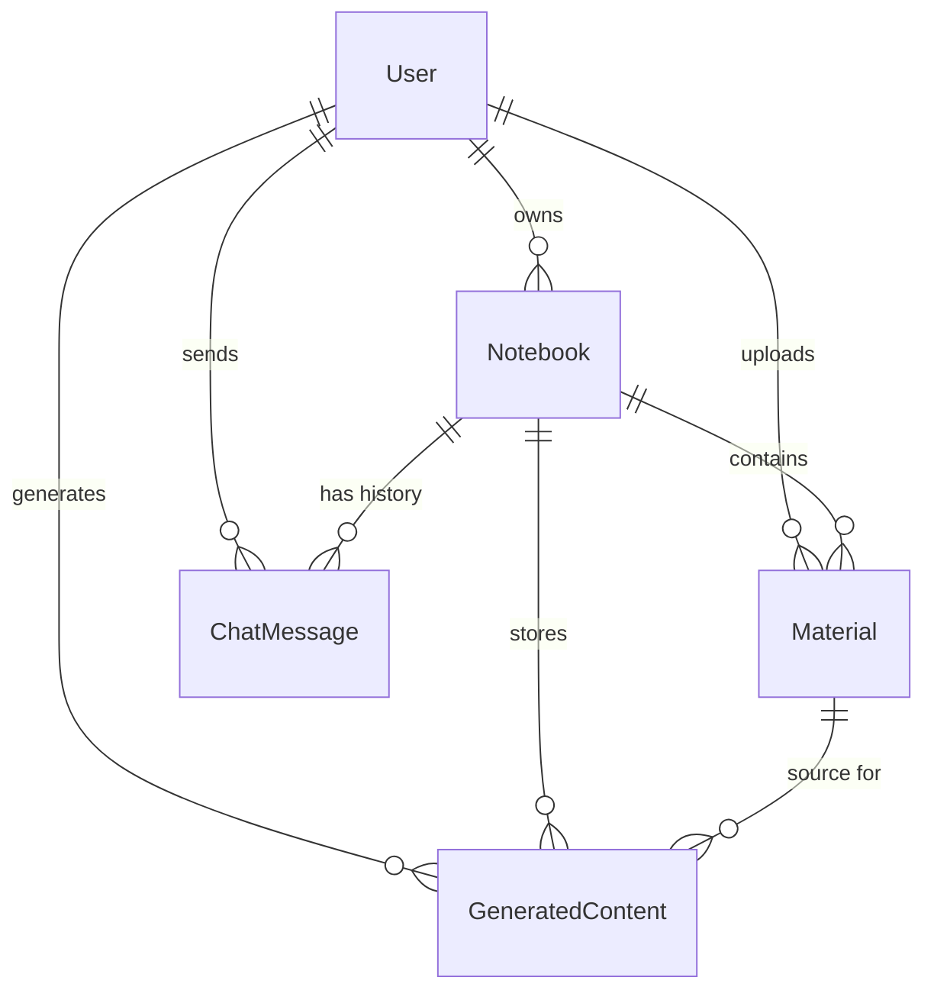

# Database Schema - Study Assistant

This document describes the data architecture of the Study Assistant application, including the relational database (PostgreSQL) and the vector database (ChromaDB).

---

## 1. Relational Database (PostgreSQL)

The relational database handles user accounts, notebook organization, material metadata, chat history, and generated content persistence.

### Entity Relationship Diagram (Abstract)

### Table Definitions

#### `users`

Stores user profile and authentication data.

- **id**: `UUID (PK)` - Unique identifier for the user.
- **email**: `String(255) (Unique, Index)` - User email for login.
- **username**: `String(100)` - Display name.
- **hashed_password**: `String(255)` - Bcrypt hashed password.
- **is_active**: `Boolean` - Account status.
- **role**: `String(50)` - User role (default: "user").
- **created_at**: `DateTime` - Timestamp of account creation.
- **updated_at**: `DateTime` - Timestamp of last update.

#### `notebooks`

Logical containers for materials and generated content.

- **id**: `UUID (PK)` - Unique identifier.
- **user_id**: `UUID (FK -> users.id, CASCADE)` - Owner of the notebook.
- **name**: `String(255)` - Name of the notebook.
- **description**: `Text` - Optional description.
- **created_at**: `DateTime`.
- **updated_at**: `DateTime`.

#### `materials`

Metadata and content of uploaded files (PDFs, PPTX, etc.).

- **id**: `UUID (PK)`.
- **user_id**: `UUID (FK -> users.id, CASCADE)`.
- **notebook_id**: `UUID (FK -> notebooks.id, SET NULL)` - Associated notebook.
- **filename**: `String(255)` - Original filename.
- **original_text**: `Text` - Extracted text content.
- **status**: `Enum (pending, processing, completed, failed)`.
- **chunk_count**: `String(10)` - Number of text chunks created for RAG.
- **created_at**: `DateTime`.
- **updated_at**: `DateTime`.

#### `chat_messages`

History of AI conversations within a notebook.

- **id**: `UUID (PK)`.
- **notebook_id**: `UUID (FK -> notebooks.id, CASCADE)`.
- **user_id**: `UUID (FK -> users.id, CASCADE)`.
- **role**: `String(20)` - 'user' or 'assistant'.
- **content**: `Text` - Message content.
- **created_at**: `DateTime`.

#### `generated_content`

Stores various AI-generated outputs for persistence.

- **id**: `UUID (PK)`.
- **notebook_id**: `UUID (FK -> notebooks.id, CASCADE)`.
- **user_id**: `UUID (FK -> users.id, CASCADE)`.
- **material_id**: `UUID (FK -> materials.id, CASCADE, Nullable)` - Source material if applicable.
- **content_type**: `String(50)` - Type of content: `flashcards`, `quiz`, `slides`, `audio`, `video`.
- **title**: `String(255)` - Optional title for the content.
- **data**: `JSONB` - Structured data representing the content (e.g., list of questions, slide data).
- **created_at**: `DateTime`.

---

## 2. Vector Database (ChromaDB)

ChromaDB is used for storing document embeddings to enable Retrieval-Augmented Generation (RAG).

### Collections

- **Name Format**: `user_{user_id}_chapters`
- **Purpose**: Provides data isolation per user. Chunks from all materials uploaded by a user are stored in their specific collection.

### Record Structure

Each record in a collection consists of:

- **ID**: `UUID` - Matches the chunk ID generated during processing.
- **Document**: `String` - The actual text chunk (approx. 800 characters).
- **Metadata**:
  - `source`: "chapter" (constant)
  - `material_id`: `UUID` - Links chunk back to the source material.
  - `user_id`: `UUID` - Links chunk to the owner.
- **Embedding**: High-dimensional vector generated by `HuggingFaceEmbeddings`.

---

## 3. Storage (Local Filesystem)

The application also uses a local `output/` directory for temporary or served files:

- **Path**: `backend/output/`
- **Contents**:
  - `.mp3`: Generated podcast audios.
  - `.mp4`: Generated explainer videos.
  - `.pptx`: Generated presentations.
  - `.png`: Temporary slide captures (during video generation).
